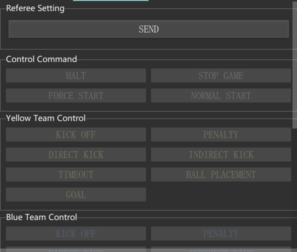
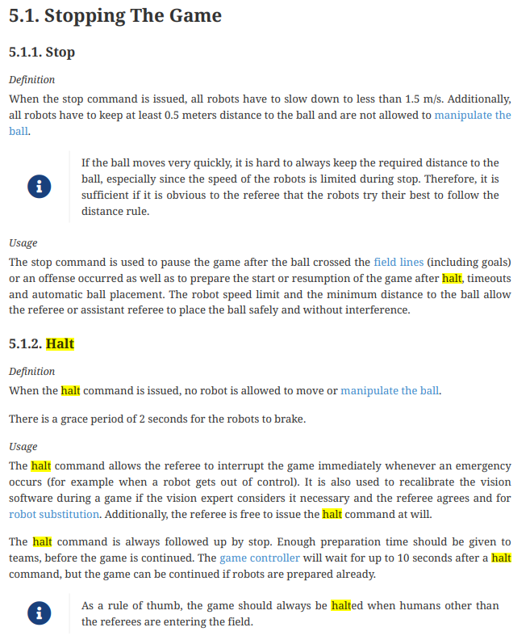
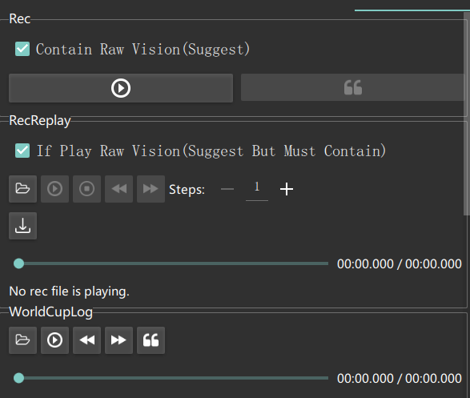

!!! abstract
	本文档主要说明falcon的软件界面和功能使用

## 关于软件

- falcon是赛队自研的可视化调试平台，主要功能是处理裸视觉并绘制，并完成视觉机与控制程序之间的通讯和信息交接
- 为了优化调试体验，falcon中还集成了更多功能，有意义的信息可以以多种方式显示，还有很多例如裁判盒和LOG录播的交互功能，尽量使主要操作都可以在单一界面中完成
- [falcon源码仓库](https://gitlab.com/src-ssl/owl2)

## 主界面

左侧为画布区域，右侧为控制面板

## 画布区域

用于显示视觉信息和调试语句，并提供若干交互操作，方便调试

### 显示信息

=== ":material-eye:{ .lg .middle } 视觉显示模式"

	- Origin：裸视觉 
	
	- Filter B：滤波后视觉，配有蓝方debug
	
	- Filter Y：滤波后视觉，配有黄方debug

=== ":fontawesome-solid-arrow-down-up-across-line:{ .lg .middle } 坐标显示"

	当前鼠标位置的对应坐标
	
	Left：左边方坐标系（X轴正方向向右，Y轴正方向向下）
		
	Right：右边方坐标系（X轴正方向向左，Y轴正方向向上）

=== ":fontawesome-solid-desktop:{ .lg .middle } FPS"

	由上到下分别为:
	
	视觉帧率
	
	蓝方通讯帧率
	
	黄方通讯帧率

=== ":material-scale-balance:{ .lg .middle } 下拉栏"
	
	Widget: 调出falcon一系列的组件, 其中Remote Control常常通过其调出
	
	Layout：界面的布局
		
		Save As：保存现在界面的布局
		Load：引入特定界面的布局
	*[Layout]: 保存形式为.json文件，在./Layout路径下，可直接更改
	
	Formation：特定阵型的操作
		
		Save As：保存现在场上的机器人站位，快捷键 Ctrl+s
		Load：引入特定阵型，快捷键 Ctrl+v
	*[Formation]: 保存形式为.json文件，在./Formations路径下，可直接更改
	
	Help：查阅软件信息
		
		About：展示基本信息，如版本
		Language: 切换语言

### 交互操作

=== "鼠标左键"
	- 单击：快速设置球的位置
	- 拖动：拖拽球
	- 双击：弹窗，精确设置球的位置（cm）
	- +Ctrl：拉拽设置球的速度
=== "鼠标右键"
	- 单击：连续两次，第一次选车，第二次设置位置
	- 拖动：拖拽机器人
	- 双击：弹窗，精确设置机器人的位置（cm）和朝向(角度制)
	- +Ctrl：旋转设置机器人的朝向
	- 注：被选中的机器人周围有红圈
	- 注: 画面下方的场外区域为已下场的机器人
=== "鼠标滚轮"
	- 滚动：放大或缩小画面
	- 点击：拖动画面
	- +Alt：开裁判盒时，设置放球点
	- +Ctrl：拖动框出显示区域
=== "键盘"
 	- 数字键("`","1","2","3","4","5","6","7","8","9","0","-","=","i","o","p")：控制蓝方上场数量（默认连号）
 	- Ctrl + 数字键：控制黄方上场数量（默认连号）
 	- Shift + 数字键：控制蓝方特定ID机器人上场/下场
 	- Alt + 数字键：控制黄方特定ID机器人上场/下场

## 控制面板

!!!abstract
	共有五个模块，从左到右分别为主控制板(CONTROLBOARD)、裁判盒(REFEREEBOX)、展示面板(VIEWER)、辅助功能面板(TOOLKIT) 以及参数管理面板(Settings)。如果功能过多显示不全，可以向下滑动查看
### 主控制板

=== "Vision"
	视觉设置

		选择仿真或实车模式
		
		选择使用的相机(id:0~7)
		
		连接视觉
=== "Simulator"
	仿真器设置
  	
		开启或关闭
	
		后台或可视化运行
	
		弹窗，选择仿真器路径
=== "Cray"
	遥控软件
	
		开启/关闭
	
		弹窗，选择路径
=== "Controller"
	控制器设置
	
		蓝/黄方控制器开启/关闭
	
		选边
	
		弹窗，选择使用的控制器的路径
=== "Kill"
	杀死运行的软件
<figure markdown="span">
  
  <figcaption>CONTROLBOARD</figcaption>
</figure>

### 裁判盒

=== "Referee Setting"
	裁判盒设置

	开启或关闭
	
	手动或[自动操作](https://gitlab.com/src-ssl/src/-/wikis/Software/Tigers-AutoRef仿真模式下的使用)
=== "Control Command"
	全局指令，两队的相同

		急停
	
		停止比赛
	
		强制开始
	
		开启开球/点球
=== "Yellow Team Control"
	黄队进攻指令，蓝方收到后防守.依次为
		开球

		点球
	
		直接任意球
	
		间接任意球
	
		申请暂停
	
		自动放球，Alt + 滚轮点击设置放球点
	
		取得进球

​	
<figure markdown="span">
  
  <figcaption>REFEREEBOX</figcaption>
</figure>

??? danger "diff between halt & stop"
	
??? danger "diff between force start &normal start"
	- force start：强制开始，不管裁判盒的指令是什么，都会开始比赛
	- normal start：根据裁判盒的指令开始比赛

<!-- ### 展示面板

- Display：图表展示数据
	- 开启或关闭
	- 弹窗，设置展示模式和图表格式(速度信息单位：m/s)
- Robot：显示机器人的其他信息
  	- 是否上场，上场为蓝或黄，否则为灰
  	- 红外，触发变红
  	- 电量：百分数 -->

### 辅助功能面板

=== "Rec"
	录制log，记录场上显示的所有信息
		是否录制裸视觉

		开启/关闭录制
	
		设置断点，第一次点击暂停录制，第二次恢复

=== "RecReplay"
	播放log
		是否播放裸视觉，建议选择，但需保证log中包含裸视觉

		弹窗，选择要播放的log文件
	
		开启/暂停播放
	
		终止播放
	
		快进x帧
	
		后退x帧
	
		Steps: 设置自动播放的倍速和快进/后退的步长
	
		进度条，可点击/拖动至预想的时刻，右侧显示当前时刻/总时长

=== "WorldCupLog"
	专门播放世界赛log，与我们录制的格式不同

<figure markdown="span">
  
  <figcaption>TOOLKIT</figcaption>
</figure>

### 参数管理面板

- 显示格式：类别名称   变量种类   数值
- 可接受种类：Int、Double/Float、Bool、String
- 修改参数：找到对应的变量，点击输入数值，一定要回车确定
- 如果是在外部.ini文件里更改的，快捷键‘r'重新上载
- 现在的参数更改后，不需要重启
- 参数管理文件说明（./config路径下）：
	- owl2.ini：重要且经常需要更改的参数，可视化显示，方便调试
	- cfg.ini：内部默认参数，一般不需要更改
	- vision.ini：视觉处理部分的参数，不熟悉视觉的不要动
	- simulator.ini：内置仿真器的参数
	- 其他均为内置仿真器参数，目前未用到
- 重要参数：
- owl2.ini
	=== "Alert"
	field 场地规模 Division A/B

	framearte 比赛视觉帧率
	
	isRight 选边
	
	isSimulation 仿真/实车模式
	
	isYellow 选择颜色
	
	saoAction 骚操作，小场与大场坐标轴间的转换，适用于实车模式
	

=== "AlertPort"
	
	VisionReal 实车模式下的视觉端口
	
	VisionSim 仿真模式下的视觉端口
		
		refereePortToBlue 给蓝方发送裁判指令的端口
	
		refereePortToYellow 给黄方发送裁判指令的端口
		
		serialPort 通讯串口

=== "Camera"

	total_cameras 全场相机总数，重要，决定了处理视觉时遍历的相机数目

=== "Canvas"
	
	param_canvasHeight 纵向长度
		
	param_canvasWidth 横向长度
	
	以上两个参数更改可以影响画布绘制的比例，建议与场地的相同（如Division A 4:3），数值越大场地相对越小

=== "DebugMessages"
	
	debug 是否绘制debug
	
	type_arc/line/points/robot/text 各种性质的debug是否绘制，与rbk中相同

=== "Display"
	
	display_height display图表高度，唯一一个更改后重启才能生效的
	
	其他的都可以通过弹窗设置

=== "Division A/B"
		
	if_ellipse_penalty 是否为椭圆禁区
	
	penalty_area_l 禁区前沿直线长度
	
	penalty_radius 禁区侧方圆的半径
	
	以上的参数用于2017年前的场地配置

=== "HeatMap"
	
	HeatMap 是否绘制场势热力图

=== "Size" 
	
	绘制机器人/球的尺寸

=== "Team" 
	
	队伍信息

=== "Vision" 
	一些视觉的特殊处理

[:fontawesome-solid-circle-info:{ .lg .middle} 加入CUDA的falcon编译](https://sjtu-src.github.io/Wiki/Algorithm/加入cuda的falcon编译/){ .md-button .md-button--primary}
