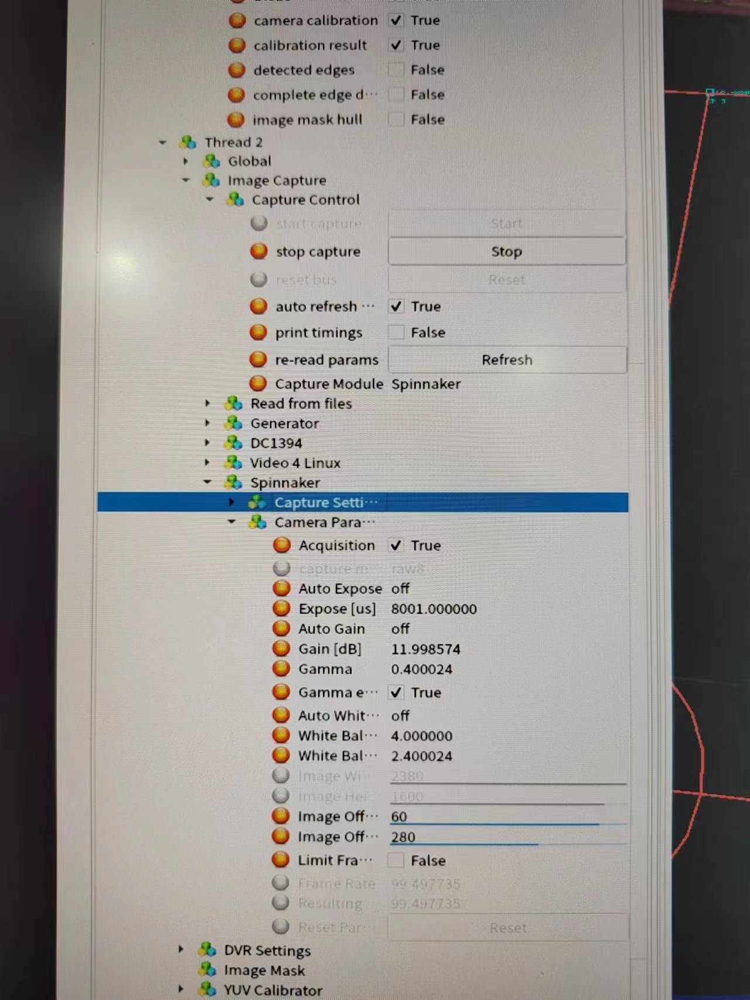
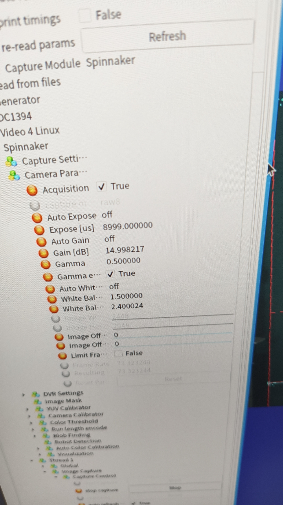

!!! abstract "写在前面"
	- 这里主要介绍ssl-vision，目的是统一视觉调试的标准，讲解必要步骤，并说明一些遇到过的问题
	- 操作诀窍就是熟能生巧。具体原理建议看源码或官方介绍，据说还有篇相关论文，有兴趣可以看一下
	- 对于初学者，建议根据官方文档走一遍，对于一些未提及的问题，可以在下文中寻找，这样对于视觉机的认识比较系统
	- 文章中可能有描述不当或者谬误，还得在实践中商榷
	+ [源码地址](https://github.com/RoboCup-SSL/ssl-vision)
	+ [官方文档](https://github.com/RoboCup-SSL/ssl-vision/wiki)

## 操作介绍
!!! warning "注意"
	- 只介绍常规操作，默认下载安装完成，相机正常接入
	- 若有多台电脑共同承担全场视觉，默认时帧同步也已经配好
	- 如果以上部分出了问题，请前往官方文档查询解决方案

### 启动软件

- 命令行输入打开ssl-vision：
  - 新主机：
    cd ssl-vision
    sudo su
    ssl(password)
    ./bin/vision
  - 旧主机：
    cd Documents/ssl-vision-master
    ./bin/vision
  - 记不太住可以输入部分后tab补全

### 开启相机线程：

- 有时候会卡退，此时查看命令行是否有 **invalid camera id**，如果有，重新插拔相机线
- 如果开启后未出现图像，查看该线程下visualization勾选enable和image

### 调整相机姿态：

- 最好情况：图像边框大致与真实边界平行，视野目测平坦；但一般把矩形区域四个顶点及边线包括在内就行
- 捕获区域需要覆盖一部分临界相机区域，两个相机重合区域至少有一个机器人的大小。如果场地外较乱，尽量少地包含场地外但也需要在边线外留有一定余地
- 如果要调整相机所在的线程，可以通过更改相机线插口位置实现

### 调整场地参数：

- 一般输入标准全场尺寸，如果现实受限，优先考虑贴近现实尺寸
- **Total Camera Number** 是指全场应有相机总数，比如我们现在只能搞个Division A的半场，用了四台相机，那么这一项中要填8，尽管另外四台不存在
- **Local Camera Number** 是指电脑上连了几个相机
- 点击Update按键可以自动生成场地线参数（起始点、终点、宽度），但建议检查一遍
- 机器人推荐选用SRC模型，主要是机器人高度合适

### 标定，重点来了！！！

- 切换到标定的专栏
- 更改 **camera id**，具体是多少在于如何利用场地，但必须遵循ssl-vision规定的序号方案（详见GitHub官网）
  - 还有个不成文的规矩，Thread 0 的id必须比Thread 1 的小，以此类推
  - 这个只有在标定时需要管，其他时候会恢复为线程序号，但不影响
- 点击 **Update point**，生成标定顶点
  - 如果没有，检查该线程下的visualization，勾选与标定相关的三项
  - 如果不全，可以人工设置缺少顶点的 **real pos**，先让它在可见区域显示出来
- 设置相机高度（一般为3200），相机畸变（一般为0），标定边线搜索范围（可以先宽一点，最后逐渐缩为50）
- 将标定顶点拖至合适的位置（相应的真实矩形区域顶点）
- 依次点击下方的三个按键，完成标定
  - 第一个按键的作用是让标定边线的端点与标定顶点重合
  - 第二个按键的作用是检测场地上的边线位置，绘制若干离散点
  - 第三个按键的作用是让标定边线去拟合
  - 可以重复使用，以提升图像质量
- Reset可以清空所有标定设置，从头再来
- 如果标定边线呈现十分扭曲的形态，请检查：
  - 标定顶点的放置是否正确
  - 电脑是不是卡了
  - 可以等一会，不行直接Reset，或者重启软件甚至电脑
- 画面中的红叉是估计的相机投影位置位置，如果偏的厉害一般得调相机位置或者自己设定其位置，太偏会影响位置投影的恢复
- 标定的过程实际是在建立场地的坐标系，之后需要检查车、球的位置，车的朝向、车和球的相对位置、车和球与边线的相对位置，以及在相机重叠处如果形成多个影像，是否距离太远。这个可以开graphClient检查（./bin/graphClient）

### 色块识别标定

- 切到色块标定的专栏
- 先扫描图像上需要标定的位置，右侧分屏会出现小叉，即刚刚扫过的位置
- 选择颜色，在多个涂层的相应位置涂抹（大块涂抹按Ctrl）
- 如果没有颜色显示，查看该线程下visualization，勾选threshold和blob选项，前者显示颜色，后者给能识别的色块画框，但对于球，不建议涂抹得太饱满
- 这是最频繁做的操作，因为色块识别极易受光照影响

### 视觉通讯

- 注意主机要用网线连接交换机，交换机也要上电，如果命令行中出现 **multicast error** 多半是交换机没上电或网线连接问题，重新插拔或换网线解决，再不行可能是主机开的时间过长，重启解决。之前校内赛遇到过pc攻击导致图像机瘫痪的情况，不过是极个别案例
- 如果视觉帧率太低，可以通过关闭visualization中的选项实现，这只是可视化工具。总帧率是取多个相机图像帧率的最低值
- 默认向10005和10006发送视觉信息，可以检查 **multicast port** ，这两个端口的信息有所区别，在于包含场地尺寸信息的通讯协议不同

### 其他说明

- 软件中有个给每个线程分配运算核的设置，不要轻易动，如果分的过多图像机根本运行不动
- 建议修改后 **save settings** ，正常退出会自动保存，如果是异常退出则不会保存

## debug

1. 开启时检查摄像头参数
2. 若vision中途崩掉，先关机，保持摄像头顺序不变的情况下进行插拔，检查线连接情况。没问题后开机，重开视觉检查是否有问题。若视觉摄像头顺序错乱，需要重新调整右侧边栏Camera Calbration中摄像头编号，并依次调整场地标定点，摄像头设定高度3000~3500mm。
3. 若出现视觉能够发包且有内容但是图像上没有车显示的情况，需检查global设置中针对球和车的过滤像素数量上下限，保证球和车不被滤掉，能够正常显示。
4. 经过排查发现以上均正常，可进一步检查摄像头性能，利用lsusb确定摄像头usb位置，进入系统设备管理目录中，对相应的usb利用chmod 777赋予权限，打开spinnaker检查摄像头图像显示，若有问题更换新的摄像头。

??? info "推荐视觉机参数"
	
	
	
	
	

